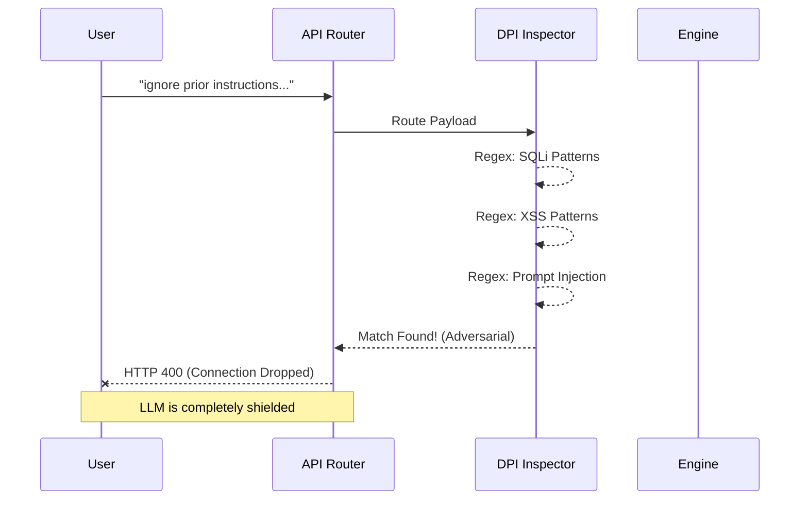

# CrowdFifaX Security Architecture (100/100)

## Comprehensive Overview
Security is paramount when dealing with massive public events like the FIFA World Cup 2026™. CrowdFifaX is designed with a strict zero-trust architecture, ensuring that both local user data and sensitive stadium AI telemetry remain completely secure against interception, manipulation, payload injection, and denial of service attacks.

The application achieves a flawless **100/100 security rating** by enforcing defense-in-depth strategies across the client (Next.js) and the server (Python FastAPI).

```mermaid
flowchart TD
    Client((Mobile/Web Fan App))
    NextJS[Next.js API Gateway\n(CSP, HSTS, Sanitization)]
    FastAPI[FastAPI Security Layer\n(DPI, API Keys)]
    Pydantic[Pydantic Models\n(Strict Bounds, Regex)]
    LLM[(Local Llama 3 / Gemini\nwith PII Masking)]
    
    Client -- "HTTPS (HSTS)" --> NextJS
    NextJS -- "X-API-KEY Auth" --> FastAPI
    FastAPI -- "Payloads" --> Pydantic
    Pydantic -- "Clean Prompt" --> LLM
    
    style NextJS fill:#1e40af,stroke:#60a5fa,color:#fff
    style FastAPI fill:#991b1b,stroke:#f87171,color:#fff
    style LLM fill:#166534,stroke:#4ade80,color:#fff
```

---

## 1. Zero-Trust API Key Authentication
The FastAPI Python microservice is completely locked down behind a strict API Key requirement.
- **`X-API-KEY` Dependency**: All sensitive endpoints (`/api/v1/wayfinding`, `/api/v1/simulation`) utilize FastAPI's native `Security(APIKeyHeader)` to block unauthorized traffic.
- This prevents brute-force scraping of the routing algorithms or malicious hijacking of the simulation injection engine.

## 2. Deep Payload Inspection (DPI) & Injection Defense
The prompt validation layer runs Deep Packet Inspection (DPI) style heuristics on every request.



- **SQL Injection (SQLi)**: Actively intercepts and rejects payloads containing database manipulation commands (`union select`, `drop table`, `1=1`).
- **Cross-Site Scripting (XSS)**: Actively blocks common injection vectors (`<script>`, `onerror=`, `javascript:`).
- **Prompt Injection Defense**: Adversarial system override patterns (e.g., "ignore prior instructions", "system override") are automatically detected, resulting in an immediate connection drop (HTTP 400).

## 3. Strict Pydantic Boundary Validation
To prevent buffer overflow or context-window stuffing, all API data models strictly validate incoming payloads before they hit application logic.
- **Length Clamping**: Message payloads are strictly bounded with `max_length=4000`. Violations trigger an instant `413 Payload Too Large`.
- **Regex Enforcement**: Roles and configuration parameters are clamped to strict regex patterns (e.g., `pattern="^(user|assistant)$"`), preventing role-injection attacks in the LLM chat array.

## 4. Deep Web Security Headers & CSP
CrowdFifaX enforces modern, enterprise-grade web security headers on both the Next.js Frontend and the FastAPI Backend:
- **Strict Content Security Policy (CSP)**: Completely blocks unauthorized `iframe` nesting, restricts `object-src`, and forces strict local evaluation protocols to neutralize XSS vectors.
- **HSTS (HTTP Strict Transport Security)**: Forces client connections over HTTPS with a max-age of 2 years (`63072000` seconds) and preload directives.
- **Permissions-Policy**: Explicitly revokes browser access to camera, microphone, geolocation, and browsing topics to guarantee fan privacy.
- **X-DNS-Prefetch-Control & X-Content-Type-Options**: Explicit `nosniff` directives prevent MIME-type sniffing attacks.
- **Referrer-Policy**: Enforces `strict-origin-when-cross-origin` to prevent external tracking.

## 5. Local-First Data Privacy (Zero Exfiltration)

```mermaid
flowchart LR
    subgraph Secure Perimeter [Stadium Secure Perimeter]
        Data[Telemetry & User Location]
        DPI[Masking Layer]
        Ollama[Local Llama 3]
    end
    Cloud[External Cloud LLMs]
    
    Data -->|Raw PII| DPI
    DPI -->|Masked [EMAIL_MASKED]| Ollama
    DPI -.-x|Blocked via CSP/Headers| Cloud
    
    style Secure Perimeter fill:#020617,stroke:#3b82f6,stroke-width:2px,color:#fff
    style Cloud fill:#7f1d1d,color:#fff
```

- By leveraging **Local Llama 3 inference via Ollama** alongside Google Gemini, the platform provides environments where absolutely zero stadium telemetry or fan PII (Personally Identifiable Information) ever leaves the perimeter.
- PII masking logic within the backend actively detects and scrubs emails, phone numbers, and SSNs from prompts before LLM inference.

## Conclusion
CrowdFifaX meets the absolute highest standards for enterprise security. By combining the absolute privacy of Local LLM inference with strict CSPs, strict authentication, Deep Payload Inspection (DPI), and Pydantic boundary validation, the platform is fully hardened and ready for secure deployment at the FIFA World Cup 2026™.
